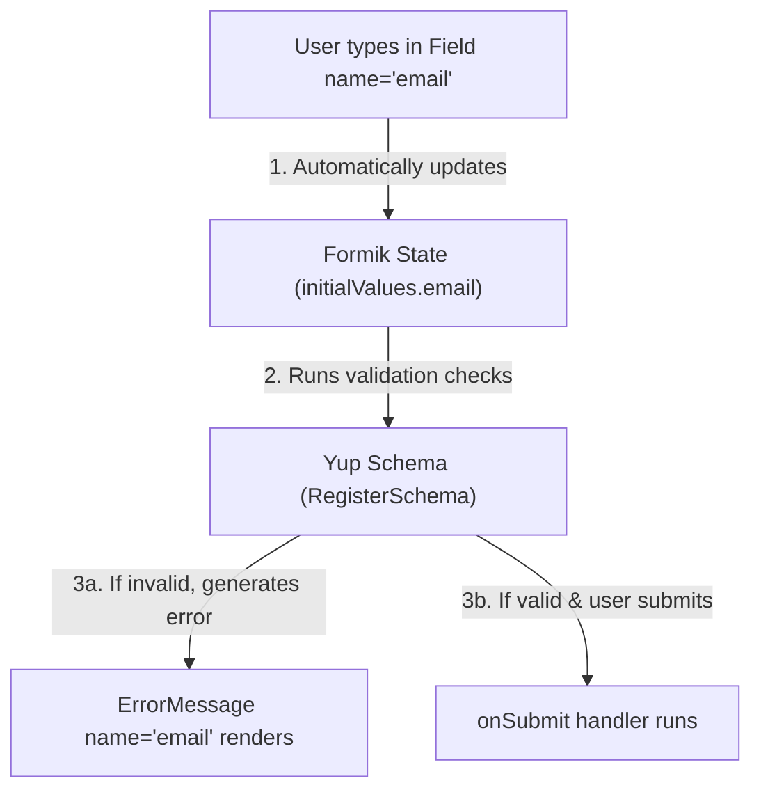

# 🚀 Student Guide: Form Validation with Formik & Yup (No Hooks Required)

Welcome! This guide will help you understand how to build clean, error-free, and validated forms in React using **Formik** and **Yup**.

Instead of writing complex state code and manual checking functions, you will learn to build forms using simple, declarative React components.

> [!NOTE]
> **Why do we need this?** In standard HTML, forms handle their own data. In React, we want to control that data instantly as the user types (this is called "state"). Formik does all that heavy lifting for us without requiring us to write complex state management code.

---

## 📦 What are Formik and Yup?

* **Formik** is a library that manages the state of your forms (what the user typed, whether there are errors, and when the form is submitting).
* **Yup** is a validation library. You define a "schema" (a list of rules) for your inputs, and Yup checks the data for you.

---

## 🔄 The Data Flow (How it works under the hood)



---

## 🛠️ Step 1: Installation & Initial Setup

To start using Formik and Yup in a React project, run this command in your project terminal:

```bash
npm install formik yup
```

---

## 📝 Step 2: The Core Components

Formik provides four main components that work together to replace standard HTML form tags:

1. **`<Formik>`**: The parent container. It holds your form configuration (`initialValues`, `validationSchema`, and `onSubmit`).
2. **`<Form>`**: Replaces the standard HTML `<form>`. It automatically handles submitting and prevents the browser page from reloading.
3. **`<Field>`**: Replaces the HTML `<input>`, `<textarea>`, and `<select>` tags. It syncs what you type directly to Formik's state using its `name` attribute.
4. **`<ErrorMessage>`**: Automatically displays the validation error message for a specific input field, but *only* after the user has interacted with it (touched it).

---

## 💻 Step-by-Step Code Example

Below is a complete, working example of a Register Form. Read the code comments to understand how each part works.

```jsx
import { Formik, Form, Field, ErrorMessage } from 'formik';
import * as Yup from 'yup';

// 1. Define the Validation Rules (Yup Schema)
const RegisterSchema = Yup.object().shape({
  username: Yup.string()
    .min(3, 'Username must be at least 3 characters long')
    .required('Username is required'),
  email: Yup.string()
    .email('Please enter a valid email address')
    .required('Email is required'),
});

export default function RegisterForm() {
  return (
    <div className="form-container">
      <h2>Register Account</h2>

      {/* 2. Configure Formik */}
      <Formik
        initialValues={{ username: '', email: '' }}
        validationSchema={RegisterSchema}
        onSubmit={(values, { resetForm }) => {
          console.log('Form successfully submitted!', values);
          resetForm(); // Clears the inputs after submit
        }}
      >
        {/* 3. Render the Form Components */}
        <Form className="border border-black p-4 rounded max-w-md mx-auto flex flex-col gap-4">
          <div className="input-group">
            <label className="block mb-1">Username</label>
            <Field 
              name="username" 
              type="text" 
              className="w-full border border-black p-2 rounded" 
            />

            {/* component="div" renders the error wrapped in a <div> */}
            <ErrorMessage name="username" component="div" className="text-red-600 text-sm mt-1" />
          </div>

          <div className="input-group">
            <label className="block mb-1">Email Address</label>
            <Field 
              name="email" 
              type="email" 
              className="w-full border border-black p-2 rounded" 
            />
            <ErrorMessage name="email" component="div" className="text-red-600 text-sm mt-1" />
          </div>

          <button 
            type="submit" 
            className="bg-black text-white p-2 rounded hover:bg-gray-800 cursor-pointer"
          >
            Register
          </button>
        </Form>
      </Formik>
    </div>
  );
}
```

---

## 🔍 Key Concepts to Remember

### 1. The Power of `name`

The `name` attribute on `<Field>` and `<ErrorMessage>` must match the key in `initialValues` **exactly**. If they don't match, the input will not update.

* `initialValues={{ email: '' }}` ➔ `<Field name="email" />` ✅
* `initialValues={{ email: '' }}` ➔ `<Field name="userEmail" />` ❌ (Will break silently)

### 2. What is "Touched"?

Formik tracks whether a user has clicked inside an input field and then clicked away (this is called the **blur** event).

* **Why it matters:** `<ErrorMessage>` only shows errors for fields that have been "touched". This prevents the form from showing red error messages as soon as the page loads.

### 3. Creating Textareas & Dropdowns

The `<Field>` component defaults to a text input. You can render other fields using the `as` prop:

```jsx
{/* Textarea for large text blocks */}
<Field 
  name="bio" 
  as="textarea" 
  rows={4} 
  className="w-full border border-black p-2 rounded" 
/>

{/* Select dropdown list */}
<Field 
  name="role" 
  as="select" 
  className="w-full border border-black p-2 rounded"
>
  <option value="">Select option...</option>
  <option value="student">Student</option>
  <option value="developer">Developer</option>
</Field>
```

### 4. Matching Passwords (Confirm Password)

A very common requirement is verifying that a password and confirm password field match. In Yup, you can use `Yup.ref` to check if a field's value matches another field:

```javascript
const SignupSchema = Yup.object().shape({
  password: Yup.string()
    .min(6, 'Password must be at least 6 characters')
    .required('Password is required'),
  confirmPassword: Yup.string()
    .oneOf([Yup.ref('password'), null], 'Passwords must match')
    .required('Please confirm your password'),
});
```

### 5. Disabling the Submit Button (Render Props)

To prevent users from clicking the submit button multiple times while an API request is loading, you can access Formik's internal `isSubmitting` state.

Instead of passing normal tags as children to `<Formik>`, we pass a function (this is called the **render props** pattern). Formik provides an object containing state variables like `isSubmitting` directly to this function:

```jsx
<Formik
  initialValues={{ username: '', email: '' }}
  onSubmit={async (values, { setSubmitting }) => {
    await submitToApi(values);
    setSubmitting(false); // re-enables the button
  }}
>
  {({ isSubmitting }) => (
    <Form className="border border-black p-4 rounded max-w-md mx-auto flex flex-col gap-4">
      {/* Inputs go here */}
      
      <button 
        type="submit" 
        disabled={isSubmitting}
        className="bg-black text-white p-2 rounded hover:bg-gray-800 disabled:opacity-50 disabled:cursor-not-allowed"
      >
        {isSubmitting ? 'Submitting...' : 'Submit'}
      </button>
    </Form>
  )}
</Formik>
```

---

## 🚨 Troubleshooting: Common Mistakes Checklist

If your form is not working, check these five things:

1. **Typo in Name?** Check if the `name` prop on your `<Field>` matches the spelling in `initialValues` down to the exact capitalization.
2. **Missing `component` prop?** Make sure your `<ErrorMessage />` has `component="div"` or `component="span"`, otherwise your custom CSS styling rules won't apply to it.
3. **Did you type the submit button correctly?** The submit button must have `type="submit"` and be placed *inside* the `<Form>` tags.
4. **Is `onSubmit` not firing?** Formik will not trigger `onSubmit` if there are any validation errors. Check the console and your inputs to see if a validation rule is failing.
5. **No Errors showing up?** Remember that validation errors only show up after you click out of the input box (blur/touched state). Try clicking inside the field, leaving it empty, and clicking outside.

---

## 🏋️ Practice Exercises

Practice is the best way to master Formik and Yup. Try building the following three forms in your application:

---

### 🟢 Exercise 1 (Easy): Standard Contact Form

Build a simple form for users to send a message.

#### Exercise 1: Fields & Validation Rules

| Field Name | Input Type | HTML Element | Validation Rules |
| :--- | :--- | :--- | :--- |
| `fullName` | `text` | `<Field>` | Required, minimum of 2 characters. |
| `email` | `email` | `<Field>` | Required, must be a valid email format. |
| `message` | `text` | `<Field as="textarea">` | Required, minimum of 10 characters. |

#### Exercise 1: Requirements

* Render error messages wrapped in a `div` tag when inputs are touched and invalid.
* Log the completed `values` object to the browser console on successful submission.
* Automatically clear all inputs using `resetForm()` when the form is submitted.

---

### 🟡 Exercise 2 (Medium): User Sign-Up Form

Build a sign-up form with password verification.

#### Exercise 2: Fields & Validation Rules

| Field Name | Input Type | HTML Element | Validation Rules |
| :--- | :--- | :--- | :--- |
| `email` | `email` | `<Field>` | Required, must be a valid email address. |
| `password` | `password` | `<Field type="password">` | Required, minimum of 6 characters. |
| `confirmPassword` | `password` | `<Field type="password">` | Required, must match password. |

#### Exercise 2: Requirements

* Show custom error messages only after a field is touched.
* Use `Yup.ref('password')` to make sure the confirmation password matches the password.
* If submission succeeds, display a standard browser `alert("Sign Up completed successfully!")`.

---

### 🔴 Exercise 3 (Hard): Course Feedback Form

Build a feedback form containing number validation, a select dropdown, and an async submit block.

#### Exercise 3: Fields & Validation Rules

| Field Name | Input Type | HTML Element | Validation Rules |
| :--- | :--- | :--- | :--- |
| `studentName` | `text` | `<Field>` | Required. |
| `age` | `number` | `<Field type="number">` | Required, must be a number between **18** and **99**. |
| `course` | select | `<Field as="select">` | Required. Options: React Basics, Advanced CSS, Node.js. |
| `comments` | text | `<Field as="textarea">` | Optional. However, if filled, it must be at least **15** characters. |

> [!TIP]
> **How to make a field optional in Yup:**
> In Yup, fields are optional by default. To set a minimum length only *if* a user decides to type something, use:
> `comments: Yup.string().min(15, 'Must be at least 15 characters')` (do **not** append `.required()`).
>
> **How to do number ranges in Yup:**
> You can restrict numbers using `.min()` and `.max()`:
> `age: Yup.number().min(18, 'Must be at least 18').max(99, 'Must be under 100').required('Age is required')`

#### Exercise 3: Requirements

* Display error messages in a distinct style (e.g., colored red).
* Render select options inside `<Field as="select">` with a default placeholder choice (e.g., *"Select a course..."*).
* Use the **render props** pattern on `<Formik>` to disable the submit button and show "Submitting..." while an async process completes (simulate this with a `setTimeout` inside `onSubmit` or an async delay).
* Reset the form inputs automatically on submission.
